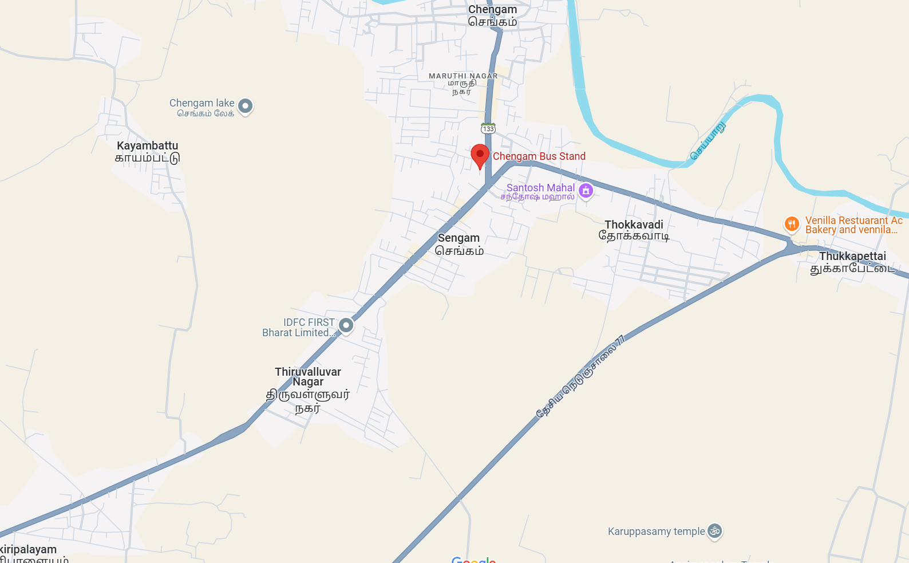
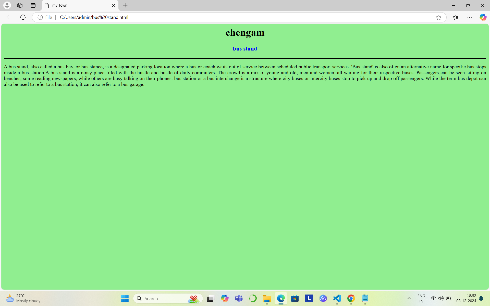
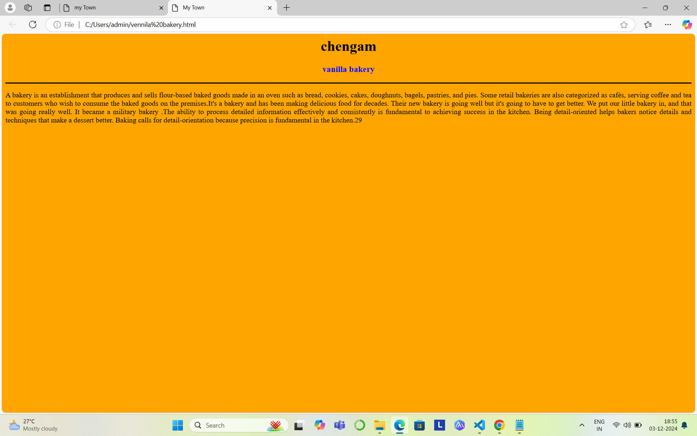
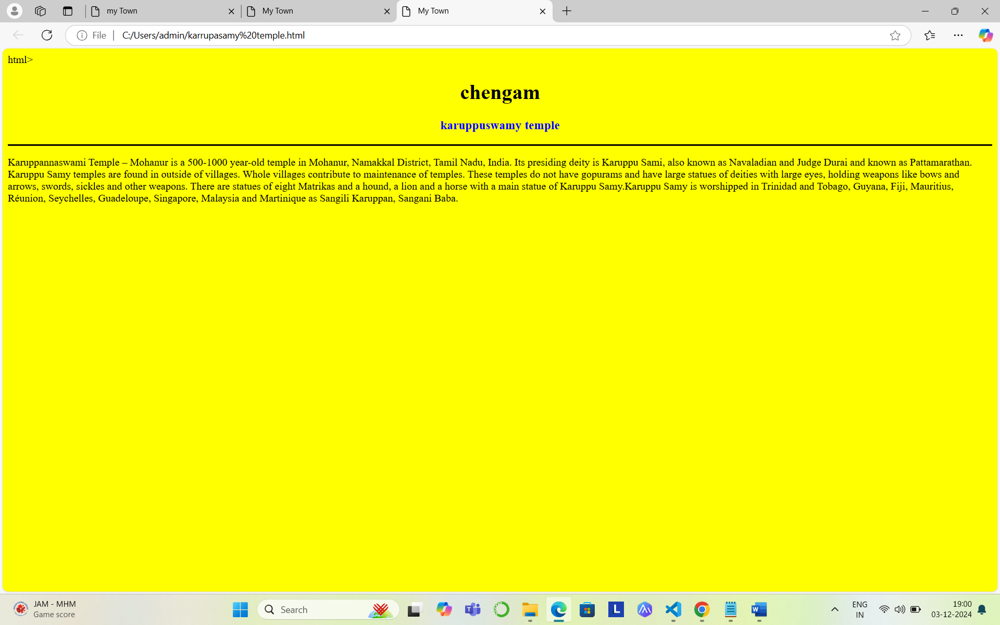
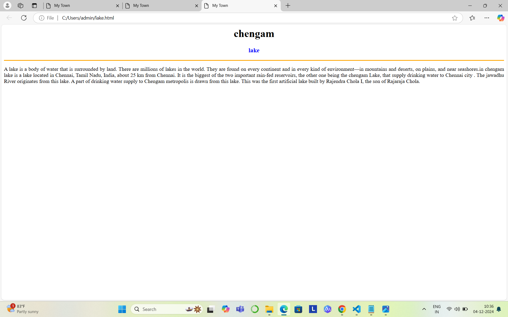
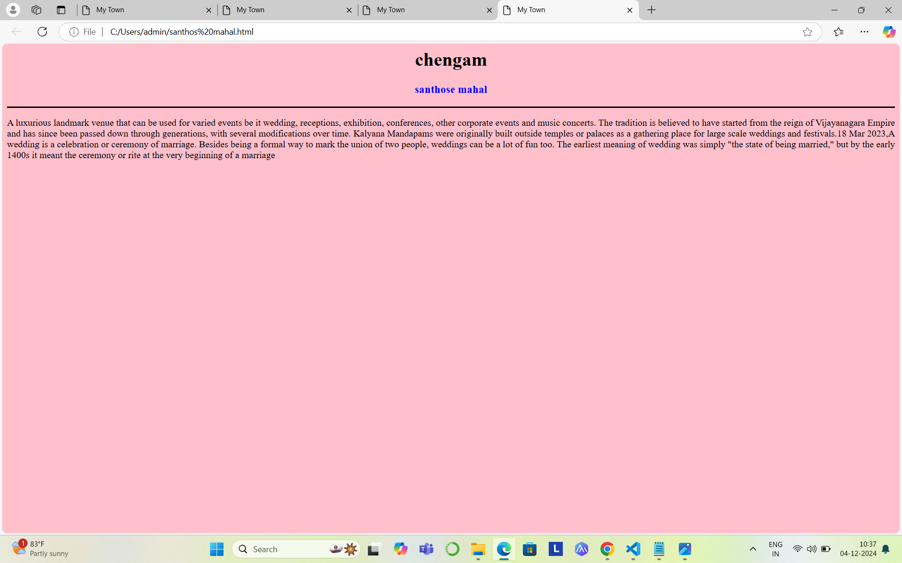

# Ex04 Places Around Me
## Date: 10.12.2024

## AIM
To develop a website to display details about the places around my house.

## DESIGN STEPS

### STEP 1
Create a Django admin interface.

### STEP 2
Download your city map from Google.

### STEP 3
Using ```<map>``` tag name the map.

### STEP 4
Create clickable regions in the image using ```<area>``` tag.

### STEP 5
Write HTML programs for all the regions identified.

### STEP 6
Execute the programs and publish them.

## CODE
```
<html>
<head>
<title>My HomeTown </title>
</head>
<body>
<h1 align="center">
<font color="red"><b>chengam</b></font>
</h1>
<h2 align="centre">
<font color="blue"><b>Dhanashree A(24900202)</b></font>
</h2>

<map name="image-map">
    <map name="image-map">
        <area target="" alt="chengam bus stand" title="chengam bus stand" href="chengam bustand.html" coords="286,163,455,215" shape="rect">
        <area target="" alt="venilla bakery" title="venilla bakery" href="venillla bakery.html" coords="1362,361,1586,429" shape="rect">
        <area target="" alt="karruppasamy" title="karruppasamy" href="karuppasamy.html" coords="1047,896,1275,955" shape="rect">
        <area target="" alt="santhose" title="santhose" href="sathosh mahal.html" coords="874,316,1048,357" shape="rect">
        <area target="" alt="lake" title="lake" href="lake.html" coords="744,669" shape="rect">
    </map>


bus stand.html
    <html>
<head>
<title>my Town</title>
</head>
<body bgcolor="lightgreen">
<h1 align="center">
<font color="black"><b>chengam</b></font>    
</h1>
<h3 align="center">
<font color="blue"><b> bus stand</b></font>    
</h3>
<hr size="3" color="black">
<p align="justify">
<front face="Georgia" size="S">
A bus stand, also called a bus bay, or bus stance, is a designated parking location where a bus or coach waits out of service between scheduled public transport services. 'Bus stand' is also often an alternative name for specific bus stops inside a bus station.A bus stand is a noisy place filled with the hustle and bustle of daily commuters. The crowd is a mix of young and old, men and women, all waiting for their respective buses. Passengers can be seen sitting on benches, some reading newspapers, while others are busy talking on their phones. bus station or a bus interchange is a structure where city buses or intercity buses stop to pick up and drop off passengers. While the term bus depot can also be used to refer to a bus station, it can also refer to a bus garage.
<p>
</body>
</html


karuppasamy temple.html
<html>
<head>
<title>My Town</title>
</head>
<body bgcolor="yellow">
<h1 align="center">
<font color="black"><b>chengam</b></font>    
</h1>
<h3 align="center">
<font color="blue"><b>karuppuswamy temple</b></font>    
</h3>
<hr size="3" color="black">
<p aligVasanthan="justify">
<front face="Georgia" size="S">
 Karuppannaswami Temple – Mohanur is a 500-1000 year-old temple in Mohanur, Namakkal District, Tamil Nadu, India. 
 Its presiding deity is Karuppu Sami, also known as Navaladian and Judge Durai and known as Pattamarathan.Karuppu Samy temples are found in outside of villages.
  Whole villages contribute to maintenance of temples. These temples do not have gopurams and have large statues of deities with large eyes, holding weapons like bows and arrows, swords, sickles and other weapons.
   There are statues of eight Matrikas and a hound, a lion and a horse with a main statue of Karuppu Samy.Karuppu Samy is worshipped in Trinidad and Tobago, Guyana, Fiji, Mauritius, Réunion, Seychelles, Guadeloupe, Singapore, Malaysia and Martinique as Sangili Karuppan, Sangani Baba.
<p>
</body>
 
 lake.html
<head>
<title>My Town</title>
</head>
<bod<html>
y bgcolor="cyan">
<h1 align="center">
<font color="black"><b>chengam</b></font>    
</h1>
<h3 align="center">
<font color="blue"><b>lake </b></font>    
</h3>
<hr size="3" color="black">
<p align="justify">
<front face="Georgia" size="S">
A lake is a body of water that is surrounded by land. There are millions of lakes in the world. They are found on every continent and in every kind of environment—in mountains and deserts, on plains, and near seashores.in chengam lake is a lake located in Chennai, Tamil Nadu, India, about 25 km from Chennai. It is the biggest of the two important rain-fed reservoirs, the other one being the chengam Lake, that supply drinking water to Chennai city . The jawadhu River originates from this lake. A part of drinking water supply to Chengam metropolis is drawn from this lake. This was the first artificial lake built by Rajendra Chola I, the son of Rajaraja Chola.
<p>
</body>
</html>

vennila bakery.html
<html>
<head>
<title>My Town</title>
</head>
<body bgcolor="orange">
<h1 align="center">
<font color="black"><b>chengam</b></font>    
</h1>
<h3 align="center">
<font color="blue"><b>vanilla bakery</b></font>    
</h3>
<hr size="3" color="black">
<p align="justify">
<front face="Georgia" size="S">
 A bakery is an establishment that produces and sells flour-based baked goods made in an oven such as bread, cookies, cakes, doughnuts, bagels, pastries, and pies. Some retail bakeries are also categorized as cafés, serving coffee and tea to customers who wish to consume the baked goods on the premises.It's a bakery and has been making delicious food for decades. Their new bakery is going well but it's going to have to get better. We put our little bakery in, and that was going really well. It became a military bakery .The ability to process detailed information effectively and consistently is fundamental to achieving success in the kitchen. Being detail-oriented helps bakers notice details and techniques that make a dessert better. Baking calls for detail-orientation because precision is fundamental in the kitchen.
<p>
</body>
</html>

santhose mahal.html

<html>
<head>
<title>My Town</title>
</head>
<body bgcolor="pink">
<h1 align="center">
<font color="black"><b>chengam</b></font>    
</h1>
<h3 align="center">
<font color="blue"><b>santhose mahal </b></font>    
</h3>
<hr size="3" color="black">
<p align="justify">
<front face="Georgia" size="S">
A luxurious landmark venue that can be used for varied events be it wedding, receptions, exhibition, conferences, other corporate events and music concerts.
The tradition is believed to have started from the reign of Vijayanagara Empire and has since been passed down through generations, with several modifications over time.
 Kalyana Mandapams were originally built outside temples or palaces as a gathering place for large scale weddings and festivals.18 Mar 2023,A wedding is a celebration or ceremony of marriage.
  Besides being a formal way to mark the union of two people, weddings can be a lot of fun too. The earliest meaning of wedding was simply "the state of being married," but by the early 1400s it meant the ceremony or rite at the very beginning of a marriage
<p>
</body>
</html> 
```

## OUTPUT








## RESULT
The program for implementing image maps using HTML is executed successfull